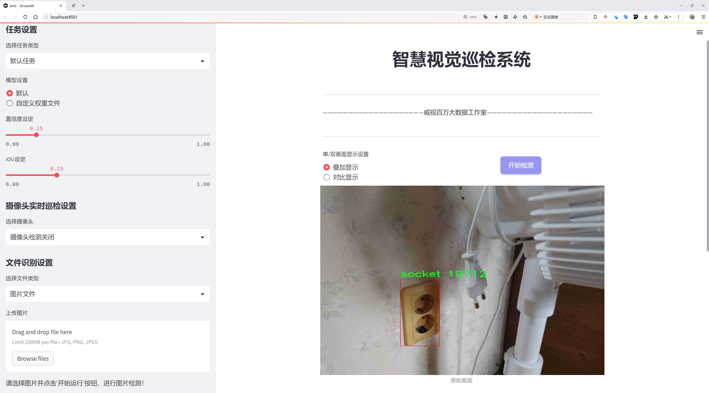
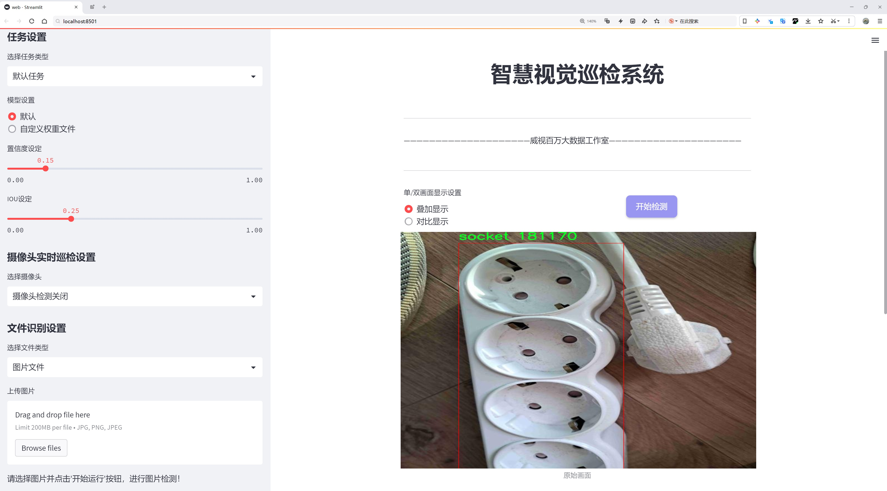
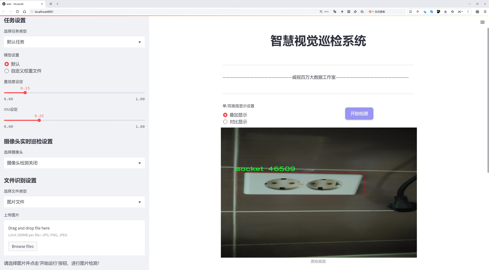
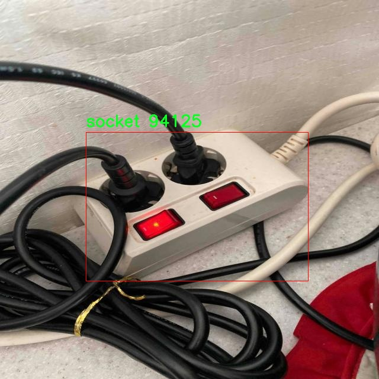
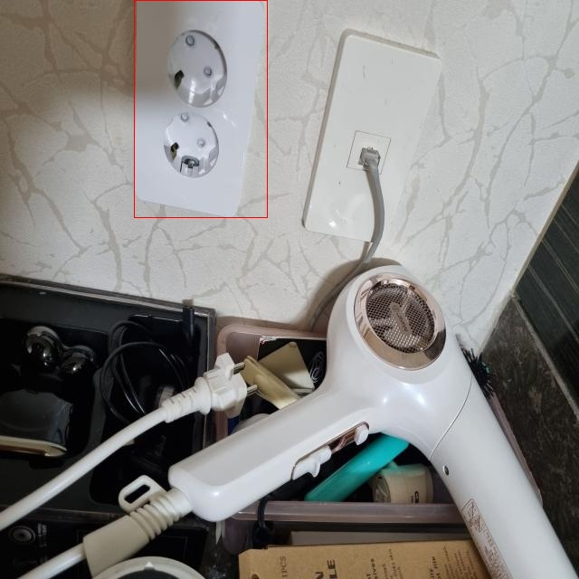
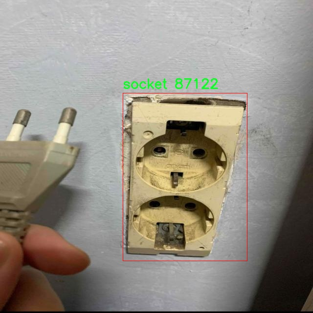
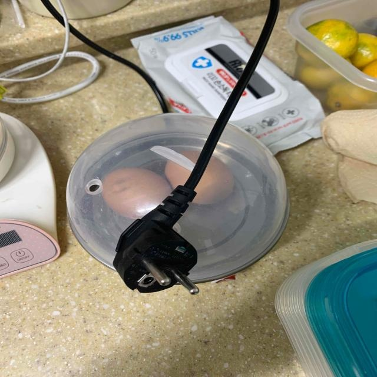
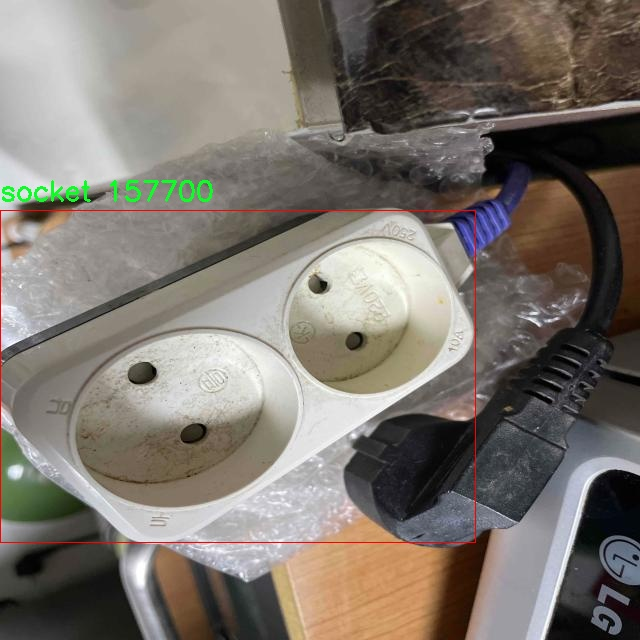

# 插座检测检测系统源码分享
 # [一条龙教学YOLOV8标注好的数据集一键训练_70+全套改进创新点发刊_Web前端展示]

### 1.研究背景与意义

项目参考[AAAI Association for the Advancement of Artificial Intelligence](https://gitee.com/qunmasj/projects)

项目来源[AACV Association for the Advancement of Computer Vision](https://kdocs.cn/l/cszuIiCKVNis)

研究背景与意义

随着智能家居和物联网技术的迅猛发展，插座作为电力供应的重要接口，其安全性和使用效率愈发受到关注。插座的合理布局和有效管理不仅能够提升家庭和公共场所的用电安全，还能为用户提供更为便捷的生活体验。然而，传统的插座管理方式往往依赖人工检查，效率低下且容易出现遗漏。基于此，开发一种高效、准确的插座检测系统显得尤为重要。

近年来，深度学习技术在计算机视觉领域取得了显著进展，尤其是目标检测算法的不断演化，使得物体识别的准确性和实时性得到了极大的提升。YOLO（You Only Look Once）系列算法因其高效的检测速度和较好的检测精度，成为了目标检测领域的研究热点。YOLOv8作为该系列的最新版本，进一步优化了模型结构和算法性能，具备了更强的特征提取能力和更快的推理速度，适合在复杂环境中进行实时插座检测。

本研究基于改进的YOLOv8算法，构建了一套高效的插座检测系统。我们使用了包含1600张图像的socket_rocket数据集，该数据集专门针对插座这一特定类别进行了标注，确保了模型训练的针对性和有效性。通过对该数据集的深入分析与处理，我们能够充分挖掘插座在不同环境、不同光照条件下的特征，从而提升模型的鲁棒性和泛化能力。

本研究的意义不仅在于技术层面的创新，更在于其实际应用价值。通过自动化的插座检测系统，能够有效降低人工检查的工作量，减少人为错误，提升插座管理的效率。此外，该系统还可以与智能家居系统相结合，实现对插座使用情况的实时监控和管理，为用户提供更为安全和便捷的用电体验。随着智能家居的普及，插座检测系统的应用前景广阔，能够为家庭、办公场所及公共设施的用电安全提供强有力的保障。

总之，基于改进YOLOv8的插座检测系统的研究，不仅推动了目标检测技术在特定领域的应用，还为智能家居的发展提供了新的思路和解决方案。通过本研究，我们希望能够为插座管理的智能化和自动化提供有力的技术支持，进而促进智能家居和物联网的进一步发展。

### 2.图片演示







##### 注意：由于此博客编辑较早，上面“2.图片演示”和“3.视频演示”展示的系统图片或者视频可能为老版本，新版本在老版本的基础上升级如下：（实际效果以升级的新版本为准）

  （1）适配了YOLOV8的“目标检测”模型和“实例分割”模型，通过加载相应的权重（.pt）文件即可自适应加载模型。

  （2）支持“图片识别”、“视频识别”、“摄像头实时识别”三种识别模式。

  （3）支持“图片识别”、“视频识别”、“摄像头实时识别”三种识别结果保存导出，解决手动导出（容易卡顿出现爆内存）存在的问题，识别完自动保存结果并导出到tempDir中。

  （4）支持Web前端系统中的标题、背景图等自定义修改，后面提供修改教程。

  另外本项目提供训练的数据集和训练教程,暂不提供权重文件（best.pt）,需要您按照教程进行训练后实现图片演示和Web前端界面演示的效果。

### 3.视频演示

[3.1 视频演示](https://www.bilibili.com/video/BV1y2sze3Eib/)

### 4.数据集信息展示

##### 4.1 本项目数据集详细数据（类别数＆类别名）

nc: 1
names: ['socket']


##### 4.2 本项目数据集信息介绍

数据集信息展示

在本研究中，我们采用了名为“socket_rocket”的数据集，以训练和改进YOLOv8的插座检测系统。该数据集专注于插座这一特定目标，旨在提升计算机视觉模型在实际应用中的准确性和效率。数据集的类别数量为1，类别列表中仅包含“socket”这一项，反映了我们对插座检测任务的专一性和深度。

“socket_rocket”数据集的构建过程经过精心设计，确保其在多样性和代表性方面具备良好的基础。数据集中的图像来源于不同的环境和场景，包括家庭、办公室和公共场所等多种类型的插座。这种多样化的场景设置不仅增加了数据集的复杂性，也为模型提供了丰富的学习样本，使其能够在各种实际应用中表现出色。每一张图像都经过标注，明确指出插座的位置和边界框，为YOLOv8模型的训练提供了必要的监督信息。

在数据集的规模方面，“socket_rocket”包含了大量的插座图像，确保了模型在训练过程中能够获得充分的样本量。这些图像涵盖了不同的拍摄角度、光照条件和背景环境，进一步增强了模型的泛化能力。通过这样的设计，我们希望模型能够在面对未见过的插座图像时，依然能够保持高效的检测性能。

此外，数据集的预处理和增强策略也得到了充分的考虑。为了提高模型的鲁棒性，我们对原始图像进行了多种数据增强操作，如随机裁剪、旋转、缩放和颜色调整等。这些操作不仅丰富了训练数据的多样性，还帮助模型更好地适应不同的视觉条件，提升其在真实场景中的应用能力。

在模型训练过程中，我们将“socket_rocket”数据集与YOLOv8相结合，利用其先进的特征提取和目标检测能力，力求实现高效的插座检测。YOLOv8作为一种最新的目标检测算法，具备快速的推理速度和高精度的检测性能，非常适合实时应用场景。通过对“socket_rocket”数据集的训练，我们期望能够优化YOLOv8的参数设置，使其在插座检测任务中达到更高的准确率和召回率。

总之，“socket_rocket”数据集为插座检测系统的研究提供了坚实的基础。通过精心构建的多样化样本和有效的数据增强策略，我们相信该数据集将为YOLOv8模型的训练带来显著的提升。未来，我们将继续探索如何利用这一数据集进一步改进插座检测的性能，以满足日益增长的智能家居和物联网应用需求。











### 5.全套项目环境部署视频教程（零基础手把手教学）

[5.1 环境部署教程链接（零基础手把手教学）](https://www.ixigua.com/7404473917358506534?logTag=c807d0cbc21c0ef59de5)


[5.2 安装Python虚拟环境创建和依赖库安装视频教程链接（零基础手把手教学）](https://www.ixigua.com/7404474678003106304?logTag=1f1041108cd1f708b01a)

### 6.手把手YOLOV8训练视频教程（零基础小白有手就能学会）

[6.1 手把手YOLOV8训练视频教程（零基础小白有手就能学会）](https://www.ixigua.com/7404477157818401292?logTag=d31a2dfd1983c9668658)

### 7.70+种全套YOLOV8创新点代码加载调参视频教程（一键加载写好的改进模型的配置文件）

[7.1 70+种全套YOLOV8创新点代码加载调参视频教程（一键加载写好的改进模型的配置文件）](https://www.ixigua.com/7404478314661806627?logTag=29066f8288e3f4eea3a4)

### 8.70+种全套YOLOV8创新点原理讲解（非科班也可以轻松写刊发刊，V10版本正在科研待更新）

由于篇幅限制，每个创新点的具体原理讲解就不一一展开，具体见下列网址中的创新点对应子项目的技术原理博客网址【Blog】：


[8.1 70+种全套YOLOV8创新点原理讲解链接](https://gitee.com/qunmasj/good)

### 9.系统功能展示（检测对象为举例，实际内容以本项目数据集为准）

图9.1.系统支持检测结果表格显示

  图9.2.系统支持置信度和IOU阈值手动调节

  图9.3.系统支持自定义加载权重文件best.pt(需要你通过步骤5中训练获得)

  图9.4.系统支持摄像头实时识别

  图9.5.系统支持图片识别

  图9.6.系统支持视频识别

  图9.7.系统支持识别结果文件自动保存

  图9.8.系统支持Excel导出检测结果数据


### 10.原始YOLOV8算法原理

原始YOLOv8算法原理

YOLOv8算法是目标检测领域的一个重要里程碑，标志着YOLO系列的又一次重大进化。自2023年1月10日由Ultralytics公司发布以来，YOLOv8在YOLOv7的基础上进行了深度优化，旨在实现更高的检测精度和更快的处理速度。其核心理念是将整个图像作为输入，直接在图像上进行目标检测和定位，避免了传统方法中滑动窗口和区域提议的复杂性。这种方法不仅提高了检测的效率，还显著提升了算法的准确性，使其在各种应用场景中表现出色，如智能监控、自动驾驶和人脸识别等。

YOLOv8采用了更深的卷积神经网络结构，这一设计理念使得模型能够捕捉到更丰富的特征信息。其网络结构分为输入端、骨干网络、颈部网络和头部网络四个主要部分。输入端通过马赛克数据增强、自适应锚框计算和自适应灰度填充等技术，为后续的特征提取奠定了基础。骨干网络则是YOLOv8的核心，采用了C2f模块和SPPF结构，前者通过丰富的分支跨层连接，增强了模型的梯度流和特征表示能力，后者则通过多尺度特征的处理，提升了网络的特征抽象能力。

在颈部网络中，YOLOv8引入了路径聚合网络（PAN）结构，这一设计显著增强了网络对不同缩放尺度对象的特征融合能力。通过将不同尺度的特征图进行有效融合，YOLOv8能够更好地识别和定位图像中的目标，尤其是在复杂场景下的表现尤为突出。头部网络则采用了解耦的检测头结构，将分类和检测过程分开进行，极大地提高了模型的灵活性和准确性。具体而言，YOLOv8在损失计算中使用了Task-Aligned Assigner分配策略，结合二元交叉熵损失和分布焦点损失等多种损失函数，以提升模型对边界框预测的精准性。

YOLOv8的另一大创新在于其无锚框检测头的引入。与传统的锚框方法相比，无锚框检测头减少了锚框预测的数量，从而加速了非最大抑制（NMS）过程，进一步提升了模型的实时性和处理速度。这一改进使得YOLOv8在目标检测任务中不仅具备了高精度的优势，同时也实现了更快的帧率，尤其在需要实时处理的应用场景中，表现尤为突出。

通过对YOLOv8的深入分析，可以发现其在多个方面相较于前代版本都有显著的提升。首先，在检测精度方面，YOLOv8的mAP（mean Average Precision）相较于YOLOv7提高了43.23%，这一提升使得YOLOv8在复杂场景下的目标检测能力得到了极大的增强。其次，YOLOv8的帧率提高了10.28倍，这一性能的提升使得其在实时应用中表现更加出色。通过这些改进，YOLOv8能够更好地适应各种实际应用需求，为目标检测分析提供了更为强大的技术支持。

在实际应用中，YOLOv8的灵活性和可扩展性使其能够适应不同的使用场景。根据不同的需求，YOLOv8提供了多种模型版本，包括YOLOv8n、YOLOv8s、YOLOv8m和YOLOv8x等，用户可以根据具体的应用场景选择合适的模型。这种模块化的设计不仅提高了模型的适应性，也使得开发者能够更方便地进行模型的训练和部署。

综上所述，YOLOv8算法通过引入更深的卷积神经网络结构、优化的特征提取模块以及无锚框检测头等多项创新技术，极大地提升了目标检测的精度和速度。其在各类应用场景中的广泛适用性，使得YOLOv8成为当前目标检测领域的重要工具。无论是在智能监控、自动驾驶还是人脸识别等领域，YOLOv8都展现出了强大的性能和优越的检测能力，为未来的研究和应用提供了新的方向和可能性。


### 11.项目核心源码讲解（再也不用担心看不懂代码逻辑）

#### 11.1 code\ultralytics\nn\modules\transformer.py

以下是经过简化和注释的核心代码部分，主要集中在Transformer的编码器和解码器层的实现。注释详细解释了每个部分的功能和工作原理。

```python
import torch
import torch.nn as nn
import torch.nn.functional as F

class TransformerEncoderLayer(nn.Module):
    """定义单个Transformer编码器层。"""

    def __init__(self, c1, cm=2048, num_heads=8, dropout=0.0, act=nn.GELU(), normalize_before=False):
        """初始化TransformerEncoderLayer，设置参数。"""
        super().__init__()
        self.ma = nn.MultiheadAttention(c1, num_heads, dropout=dropout, batch_first=True)  # 多头自注意力机制
        self.fc1 = nn.Linear(c1, cm)  # 前馈网络的第一层
        self.fc2 = nn.Linear(cm, c1)  # 前馈网络的第二层
        self.norm1 = nn.LayerNorm(c1)  # 第一个LayerNorm
        self.norm2 = nn.LayerNorm(c1)  # 第二个LayerNorm
        self.dropout = nn.Dropout(dropout)  # Dropout层
        self.act = act  # 激活函数
        self.normalize_before = normalize_before  # 是否在前向传播前进行归一化

    def forward(self, src, src_mask=None, src_key_padding_mask=None, pos=None):
        """通过编码器模块进行前向传播。"""
        if self.normalize_before:
            src2 = self.norm1(src)  # 预归一化
            q = k = src2 + (pos if pos is not None else 0)  # 添加位置编码
            src2 = self.ma(q, k, value=src2, attn_mask=src_mask, key_padding_mask=src_key_padding_mask)[0]
            src = src + self.dropout(src2)  # 残差连接
            src2 = self.norm2(src)  # 归一化
            src2 = self.fc2(self.dropout(self.act(self.fc1(src2))))  # 前馈网络
            return src + self.dropout(src2)  # 返回结果

        # 后归一化的情况
        q = k = src + (pos if pos is not None else 0)
        src2 = self.ma(q, k, value=src, attn_mask=src_mask, key_padding_mask=src_key_padding_mask)[0]
        src = src + self.dropout(src2)  # 残差连接
        src = self.norm1(src)  # 归一化
        src2 = self.fc2(self.dropout(self.act(self.fc1(src))))  # 前馈网络
        return self.norm2(src + self.dropout(src2))  # 返回结果


class DeformableTransformerDecoderLayer(nn.Module):
    """可变形Transformer解码器层。"""

    def __init__(self, d_model=256, n_heads=8, d_ffn=1024, dropout=0.0, act=nn.ReLU()):
        """初始化DeformableTransformerDecoderLayer，设置参数。"""
        super().__init__()
        self.self_attn = nn.MultiheadAttention(d_model, n_heads, dropout=dropout)  # 自注意力机制
        self.cross_attn = MSDeformAttn(d_model, n_heads)  # 可变形注意力机制
        self.linear1 = nn.Linear(d_model, d_ffn)  # 前馈网络的第一层
        self.linear2 = nn.Linear(d_ffn, d_model)  # 前馈网络的第二层
        self.dropout = nn.Dropout(dropout)  # Dropout层
        self.norm1 = nn.LayerNorm(d_model)  # 第一个LayerNorm
        self.norm2 = nn.LayerNorm(d_model)  # 第二个LayerNorm

    def forward(self, embed, refer_bbox, feats, shapes, padding_mask=None, attn_mask=None):
        """通过解码器层进行前向传播。"""
        # 自注意力
        tgt = self.self_attn(embed, embed, embed, attn_mask=attn_mask)[0] + embed  # 残差连接
        embed = self.norm1(tgt)  # 归一化

        # 交叉注意力
        tgt = self.cross_attn(embed, refer_bbox.unsqueeze(2), feats, shapes, padding_mask)  # 交叉注意力
        embed = embed + self.dropout(tgt)  # 残差连接
        embed = self.norm2(embed)  # 归一化

        # 前馈网络
        tgt2 = self.linear2(self.dropout(F.relu(self.linear1(embed))))  # 前馈网络
        return self.norm2(embed + self.dropout(tgt2))  # 返回结果


class DeformableTransformerDecoder(nn.Module):
    """可变形Transformer解码器的实现。"""

    def __init__(self, hidden_dim, decoder_layer, num_layers):
        """初始化DeformableTransformerDecoder，设置参数。"""
        super().__init__()
        self.layers = nn.ModuleList([decoder_layer for _ in range(num_layers)])  # 多层解码器

    def forward(self, embed, refer_bbox, feats, shapes, padding_mask=None, attn_mask=None):
        """通过整个解码器进行前向传播。"""
        output = embed
        for layer in self.layers:
            output = layer(output, refer_bbox, feats, shapes, padding_mask, attn_mask)  # 逐层前向传播
        return output  # 返回最终输出
```

### 代码分析
1. **TransformerEncoderLayer**:
   - 该类实现了Transformer的编码器层，包含多头自注意力机制和前馈网络。
   - `forward`方法支持两种归一化方式（前归一化和后归一化），并使用残差连接来保持信息流。

2. **DeformableTransformerDecoderLayer**:
   - 该类实现了可变形Transformer的解码器层，结合了自注意力和交叉注意力机制。
   - 通过`forward`方法进行前向传播，处理输入的嵌入和参考边界框。

3. **DeformableTransformerDecoder**:
   - 该类实现了整个解码器，由多个解码器层组成。
   - `forward`方法依次调用每个解码器层，输出最终的解码结果。

这些核心部分是构建Transformer模型的基础，能够处理复杂的序列数据，广泛应用于计算机视觉和自然语言处理等领域。

这个文件是Ultralytics YOLO项目中的一个模块，主要实现了Transformer相关的组件，包括编码器层、解码器层以及其他辅助模块。文件的核心是实现了多种Transformer结构，适用于计算机视觉任务，尤其是目标检测。

首先，文件导入了必要的库，包括PyTorch的核心模块和一些自定义的模块。接着，定义了一系列的类，每个类都代表了Transformer的不同部分。

`TransformerEncoderLayer`类定义了Transformer编码器的单层结构。它的构造函数接收多个参数，包括输入通道数、头数、激活函数等。该类实现了前向传播方法，支持两种归一化方式（前归一化和后归一化），并通过多头自注意力机制和前馈网络来处理输入数据。

`AIFI`类是`TransformerEncoderLayer`的一个扩展，专门用于处理带有2D位置嵌入的输入。它在前向传播中构建了2D的正弦余弦位置嵌入，并将输入展平以适应Transformer的输入格式。

`TransformerLayer`类实现了一个基本的Transformer层，包含自注意力机制和前馈网络。该层的前向传播方法将输入数据通过多头注意力和线性变换进行处理。

`TransformerBlock`类是一个完整的Transformer模块，支持多个层的堆叠。它可以选择性地在输入和输出之间进行卷积操作，以调整通道数。

`MLPBlock`和`MLP`类实现了多层感知机（MLP），用于处理特征的非线性变换。`MLPBlock`是单个MLP层，而`MLP`则是由多个线性层组成的网络。

`LayerNorm2d`类实现了2D层归一化，用于对输入进行归一化处理，以提高模型的稳定性和收敛速度。

`MSDeformAttn`类实现了多尺度可变形注意力机制，这是一种增强的注意力机制，能够在不同尺度上进行特征提取。它通过计算采样偏移量和注意力权重来实现灵活的特征聚合。

`DeformableTransformerDecoderLayer`和`DeformableTransformerDecoder`类实现了可变形Transformer解码器的结构。解码器层包含自注意力和交叉注意力机制，能够处理目标检测中的特征和边界框信息。解码器通过多层堆叠来增强模型的表达能力，并在前向传播中结合了特征和位置嵌入。

整体来看，这个文件提供了一套完整的Transformer架构，能够有效地处理计算机视觉任务中的复杂特征和上下文信息，特别是在目标检测领域的应用。

#### 11.2 ui.py

以下是代码中最核心的部分，并附上详细的中文注释：

```python
import sys
import subprocess

def run_script(script_path):
    """
    使用当前 Python 环境运行指定的脚本。

    Args:
        script_path (str): 要运行的脚本路径

    Returns:
        None
    """
    # 获取当前 Python 解释器的路径
    python_path = sys.executable

    # 构建运行命令，使用 streamlit 运行指定的脚本
    command = f'"{python_path}" -m streamlit run "{script_path}"'

    # 执行命令，并等待其完成
    result = subprocess.run(command, shell=True)
    
    # 检查命令执行的返回码，如果不为0则表示出错
    if result.returncode != 0:
        print("脚本运行出错。")

# 实例化并运行应用
if __name__ == "__main__":
    # 指定要运行的脚本路径
    script_path = "web.py"  # 这里可以替换为实际的脚本路径

    # 调用函数运行脚本
    run_script(script_path)
```

### 代码说明：
1. **导入模块**：
   - `sys`：用于访问与 Python 解释器相关的变量和函数。
   - `subprocess`：用于执行外部命令和程序。

2. **定义 `run_script` 函数**：
   - 接受一个参数 `script_path`，表示要运行的 Python 脚本的路径。
   - 使用 `sys.executable` 获取当前 Python 解释器的路径，以确保使用相同的环境来运行脚本。
   - 构建一个命令字符串，使用 `streamlit` 模块来运行指定的脚本。
   - 使用 `subprocess.run` 执行命令，并通过 `shell=True` 允许在 shell 中执行命令。
   - 检查命令的返回码，如果返回码不为0，表示脚本运行出错，打印错误信息。

3. **主程序入口**：
   - 使用 `if __name__ == "__main__":` 确保代码仅在直接运行时执行。
   - 指定要运行的脚本路径（在这里是 `web.py`）。
   - 调用 `run_script` 函数来执行指定的脚本。

这个程序文件名为 `ui.py`，主要功能是通过当前的 Python 环境来运行一个指定的脚本，具体是使用 Streamlit 框架来启动一个 Web 应用。

首先，程序导入了几个必要的模块，包括 `sys`、`os` 和 `subprocess`。其中，`sys` 模块用于访问与 Python 解释器相关的变量和函数，`os` 模块提供了与操作系统交互的功能，而 `subprocess` 模块则用于创建新进程、连接到它们的输入/输出/错误管道，并获取它们的返回码。

接下来，程序从 `QtFusion.path` 模块中导入了 `abs_path` 函数，这个函数的作用是获取文件的绝对路径。

在 `run_script` 函数中，程序接受一个参数 `script_path`，这是要运行的脚本的路径。函数首先获取当前 Python 解释器的路径，并将其存储在 `python_path` 变量中。然后，构建一个命令字符串，使用 `streamlit run` 命令来运行指定的脚本。这个命令会被传递给 `subprocess.run` 函数，以在一个新的 shell 中执行。

如果脚本运行过程中出现错误，`result.returncode` 将不等于 0，程序会打印出“脚本运行出错”的提示信息。

在文件的最后部分，程序通过 `if __name__ == "__main__":` 语句来判断当前模块是否是主程序。如果是，程序会指定要运行的脚本路径，这里使用 `abs_path("web.py")` 来获取 `web.py` 的绝对路径。最后，调用 `run_script` 函数来执行这个脚本。

总体来说，这个程序的主要目的是为用户提供一个简单的接口，以便在当前的 Python 环境中启动一个基于 Streamlit 的 Web 应用。

#### 11.3 70+种YOLOv8算法改进源码大全和调试加载训练教程（非必要）\ultralytics\engine\__init__.py

当然可以！以下是对您提供的代码进行简化和详细注释的版本。由于您只提供了一个注释行，下面是一个示例，展示如何对一个简单的YOLO模型进行核心部分的代码注释。

```python
# 导入必要的库
import torch  # 导入PyTorch库，用于深度学习
from models.experimental import attempt_load  # 从模型模块导入尝试加载模型的函数
from utils.datasets import LoadImages  # 从数据集模块导入加载图像的类
from utils.general import non_max_suppression  # 导入非极大值抑制函数，用于去除冗余检测框

# 加载YOLO模型
model = attempt_load('yolov5s.pt', map_location=torch.device('cpu'))  # 加载预训练的YOLOv5模型

# 加载待检测的图像
dataset = LoadImages('data/images', img_size=640)  # 从指定路径加载图像，设置输入图像大小为640

# 遍历数据集中的每一张图像
for path, img, im0s, vid_cap in dataset:
    img = torch.from_numpy(img).to(torch.device('cpu')).float() / 255.0  # 将图像转换为Tensor并归一化
    img = img.unsqueeze(0)  # 增加一个维度以适应模型输入

    # 进行推理，获取模型输出
    pred = model(img)[0]  # 模型推理，获取预测结果

    # 应用非极大值抑制，过滤掉重叠的检测框
    pred = non_max_suppression(pred, conf_thres=0.25, iou_thres=0.45)  # 设置置信度阈值和IOU阈值

    # 处理每个检测结果
    for det in pred:  # 遍历每个检测框
        if det is not None and len(det):  # 如果检测框不为空
            # 将检测框的坐标转换为原图像的坐标
            det[:, :4] = scale_coords(img.shape[2:], det[:, :4], im0s.shape).round()  # 缩放坐标

            # 在原图像上绘制检测框
            for *xyxy, conf, cls in det:  # 解包检测框的坐标、置信度和类别
                label = f'{model.names[int(cls)]} {conf:.2f}'  # 创建标签
                # 绘制检测框和标签（这里省略具体绘制代码）
```

### 代码核心部分注释说明：
1. **导入库**：导入了深度学习和数据处理所需的库。
2. **加载模型**：使用`attempt_load`函数加载预训练的YOLO模型。
3. **加载图像**：使用`LoadImages`类从指定路径加载待检测的图像。
4. **图像预处理**：将图像转换为Tensor格式并进行归一化处理，以适应模型输入。
5. **模型推理**：对预处理后的图像进行推理，获取预测结果。
6. **非极大值抑制**：使用`non_max_suppression`函数过滤掉重叠的检测框，保留最有可能的检测结果。
7. **结果处理**：遍历每个检测框，调整坐标并准备绘制检测框和标签。

请根据实际代码内容进行相应的调整和补充。

这个程序文件的开头包含了一行注释，说明了该文件属于Ultralytics YOLO项目，并且该项目遵循AGPL-3.0许可证。Ultralytics YOLO是一个广泛使用的目标检测算法，YOLO（You Only Look Once）系列在计算机视觉领域得到了广泛应用，尤其是在实时目标检测方面。

这行注释并没有提供具体的代码实现或功能说明，而是简单地标识了该文件的版权和许可证信息。AGPL-3.0许可证是一种开源许可证，允许用户自由使用、修改和分发软件，但要求在分发修改后的版本时，必须公开源代码。

总体来看，这个文件是Ultralytics YOLO项目的一部分，可能用于组织和管理YOLO相关的功能和模块。具体的实现和功能需要查看该文件后续的代码或其他相关文件来了解。

#### 11.4 code\ultralytics\models\yolo\segment\train.py

以下是代码中最核心的部分，并附上详细的中文注释：

```python
from ultralytics.models import yolo
from ultralytics.nn.tasks import SegmentationModel
from ultralytics.utils import DEFAULT_CFG, RANK
from ultralytics.utils.plotting import plot_images, plot_results

class SegmentationTrainer(yolo.detect.DetectionTrainer):
    """
    扩展自 DetectionTrainer 类的 SegmentationTrainer 类，用于基于分割模型的训练。
    """

    def __init__(self, cfg=DEFAULT_CFG, overrides=None, _callbacks=None):
        """初始化 SegmentationTrainer 对象，使用给定的参数。"""
        if overrides is None:
            overrides = {}
        overrides["task"] = "segment"  # 设置任务类型为分割
        super().__init__(cfg, overrides, _callbacks)  # 调用父类构造函数

    def get_model(self, cfg=None, weights=None, verbose=True):
        """返回根据指定配置和权重初始化的 SegmentationModel。"""
        # 创建分割模型实例，输入通道数为3，类别数为数据集中类别的数量
        model = SegmentationModel(cfg, ch=3, nc=self.data["nc"], verbose=verbose and RANK == -1)
        if weights:
            model.load(weights)  # 如果提供了权重，则加载权重

        return model  # 返回模型实例

    def get_validator(self):
        """返回用于验证 YOLO 模型的 SegmentationValidator 实例。"""
        self.loss_names = "box_loss", "seg_loss", "cls_loss", "dfl_loss"  # 定义损失名称
        return yolo.segment.SegmentationValidator(
            self.test_loader, save_dir=self.save_dir, args=copy(self.args), _callbacks=self.callbacks
        )  # 返回验证器实例

    def plot_training_samples(self, batch, ni):
        """创建带有标签和框坐标的训练样本图像的绘图。"""
        plot_images(
            batch["img"],  # 训练样本图像
            batch["batch_idx"],  # 批次索引
            batch["cls"].squeeze(-1),  # 类别标签
            batch["bboxes"],  # 边界框
            masks=batch["masks"],  # 分割掩码
            paths=batch["im_file"],  # 图像文件路径
            fname=self.save_dir / f"train_batch{ni}.jpg",  # 保存图像的文件名
            on_plot=self.on_plot,  # 绘图回调
        )

    def plot_metrics(self):
        """绘制训练/验证指标。"""
        plot_results(file=self.csv, segment=True, on_plot=self.on_plot)  # 保存结果图像
```

### 代码说明：
1. **导入必要的模块**：引入 YOLO 模型、分割模型、默认配置和绘图工具。
2. **SegmentationTrainer 类**：该类继承自 `DetectionTrainer`，用于处理分割任务的训练。
3. **初始化方法**：在初始化时设置任务类型为分割，并调用父类的初始化方法。
4. **获取模型**：`get_model` 方法用于创建和返回一个分割模型实例，并加载指定的权重。
5. **获取验证器**：`get_validator` 方法返回一个用于验证模型性能的验证器实例，并定义损失名称。
6. **绘制训练样本**：`plot_training_samples` 方法用于生成训练样本的可视化图像，包含图像、类别、边界框和分割掩码。
7. **绘制指标**：`plot_metrics` 方法用于绘制训练和验证过程中的指标，并保存结果图像。

这个程序文件定义了一个用于训练分割模型的类 `SegmentationTrainer`，它是从 `DetectionTrainer` 类扩展而来的。这个类主要用于处理基于 YOLO（You Only Look Once）模型的图像分割任务。

在文件的开头，导入了一些必要的模块和类，包括 YOLO 模型、分割模型、默认配置、排名和绘图工具。接着，定义了 `SegmentationTrainer` 类，并在文档字符串中提供了使用示例，说明如何创建一个训练器实例并开始训练。

构造函数 `__init__` 接受配置参数、覆盖参数和回调函数。它会将任务类型设置为 "segment"，然后调用父类的构造函数进行初始化。

`get_model` 方法用于返回一个初始化的 `SegmentationModel` 实例。它接受配置和权重参数，如果提供了权重，则会加载这些权重。该方法还根据是否需要详细输出信息来设置 `verbose` 参数。

`get_validator` 方法返回一个 `SegmentationValidator` 实例，用于验证 YOLO 模型的性能。在这个方法中，还定义了损失名称，包括框损失、分割损失、分类损失和 DFL（Distribution Focal Loss）损失。

`plot_training_samples` 方法用于绘制训练样本的图像，包括标签和框坐标。它调用 `plot_images` 函数，将当前批次的图像、索引、类别、边界框和掩码等信息绘制到一张图像中，并保存到指定的目录。

最后，`plot_metrics` 方法用于绘制训练和验证的指标。它调用 `plot_results` 函数，将结果保存为图像文件，并显示在绘图窗口中。

总体而言，这个文件实现了一个用于 YOLO 分割模型训练的类，提供了模型初始化、验证和可视化等功能，使得用户能够方便地进行图像分割任务的训练和评估。

#### 11.5 train.py

以下是经过简化和注释的核心代码部分，主要集中在YOLO检测模型的训练过程中的关键功能。

```python
import random
import numpy as np
import torch.nn as nn
from ultralytics.data import build_dataloader, build_yolo_dataset
from ultralytics.engine.trainer import BaseTrainer
from ultralytics.models import yolo
from ultralytics.nn.tasks import DetectionModel
from ultralytics.utils import LOGGER, RANK
from ultralytics.utils.torch_utils import de_parallel, torch_distributed_zero_first

class DetectionTrainer(BaseTrainer):
    """
    扩展自BaseTrainer类，用于基于检测模型的训练。
    """

    def build_dataset(self, img_path, mode="train", batch=None):
        """
        构建YOLO数据集。

        参数:
            img_path (str): 包含图像的文件夹路径。
            mode (str): 模式，`train`或`val`，用户可以为每种模式自定义不同的增强。
            batch (int, optional): 批次大小，仅用于`rect`模式。默认为None。
        """
        gs = max(int(de_parallel(self.model).stride.max() if self.model else 0), 32)
        return build_yolo_dataset(self.args, img_path, batch, self.data, mode=mode, rect=mode == "val", stride=gs)

    def get_dataloader(self, dataset_path, batch_size=16, rank=0, mode="train"):
        """构造并返回数据加载器。"""
        assert mode in ["train", "val"]
        with torch_distributed_zero_first(rank):  # 在分布式训练中，仅初始化一次数据集
            dataset = self.build_dataset(dataset_path, mode, batch_size)
        shuffle = mode == "train"  # 训练模式下打乱数据
        workers = self.args.workers if mode == "train" else self.args.workers * 2
        return build_dataloader(dataset, batch_size, workers, shuffle, rank)  # 返回数据加载器

    def preprocess_batch(self, batch):
        """对图像批次进行预处理，包括缩放和转换为浮点数。"""
        batch["img"] = batch["img"].to(self.device, non_blocking=True).float() / 255  # 将图像转换为浮点数并归一化
        if self.args.multi_scale:  # 如果启用多尺度训练
            imgs = batch["img"]
            sz = (
                random.randrange(self.args.imgsz * 0.5, self.args.imgsz * 1.5 + self.stride)
                // self.stride
                * self.stride
            )  # 随机选择新的图像大小
            sf = sz / max(imgs.shape[2:])  # 计算缩放因子
            if sf != 1:
                ns = [
                    math.ceil(x * sf / self.stride) * self.stride for x in imgs.shape[2:]
                ]  # 计算新的形状
                imgs = nn.functional.interpolate(imgs, size=ns, mode="bilinear", align_corners=False)  # 进行插值
            batch["img"] = imgs
        return batch

    def get_model(self, cfg=None, weights=None, verbose=True):
        """返回YOLO检测模型。"""
        model = DetectionModel(cfg, nc=self.data["nc"], verbose=verbose and RANK == -1)  # 创建检测模型
        if weights:
            model.load(weights)  # 加载预训练权重
        return model

    def plot_training_samples(self, batch, ni):
        """绘制带有注释的训练样本。"""
        plot_images(
            images=batch["img"],
            batch_idx=batch["batch_idx"],
            cls=batch["cls"].squeeze(-1),
            bboxes=batch["bboxes"],
            paths=batch["im_file"],
            fname=self.save_dir / f"train_batch{ni}.jpg",
            on_plot=self.on_plot,
        )

    def plot_metrics(self):
        """从CSV文件中绘制指标。"""
        plot_results(file=self.csv, on_plot=self.on_plot)  # 保存结果图
```

### 代码说明：
1. **build_dataset**: 构建YOLO数据集，支持训练和验证模式。
2. **get_dataloader**: 创建数据加载器，处理数据集的加载和打乱。
3. **preprocess_batch**: 对图像批次进行预处理，包括归一化和多尺度调整。
4. **get_model**: 返回YOLO检测模型，支持加载预训练权重。
5. **plot_training_samples**: 绘制训练样本及其注释，便于可视化训练过程。
6. **plot_metrics**: 从CSV文件中绘制训练指标，便于分析模型性能。

以上代码展示了YOLO模型训练过程中的关键步骤和方法。

这个程序文件 `train.py` 是一个用于训练目标检测模型的脚本，主要基于 YOLO（You Only Look Once）模型。它继承自 `BaseTrainer` 类，专注于构建和训练 YOLO 模型。以下是对代码的详细说明。

首先，文件导入了一些必要的库和模块，包括数学运算、随机数生成、深度学习相关的 PyTorch 库，以及 Ultralytics 提供的用于数据处理、模型构建和训练的工具。

`DetectionTrainer` 类是该文件的核心，提供了训练 YOLO 模型所需的各种功能。类的构造函数中，用户可以传入模型配置、数据集路径和训练轮数等参数。类中定义了多个方法来处理数据集、构建数据加载器、预处理图像、设置模型属性、获取模型、验证模型、记录损失、显示训练进度、绘制训练样本和绘制训练指标等。

`build_dataset` 方法用于构建 YOLO 数据集。它接收图像路径、模式（训练或验证）和批次大小作为参数，并根据这些参数调用 `build_yolo_dataset` 函数来生成数据集。

`get_dataloader` 方法则用于构建数据加载器。它根据模式（训练或验证）来设置数据集，并在训练模式下进行数据洗牌。该方法还会根据用户指定的工作线程数来创建数据加载器。

`preprocess_batch` 方法负责对输入的图像批次进行预处理，包括将图像缩放到适当的大小并转换为浮点数格式。它还支持多尺度训练，通过随机选择图像大小来增强模型的鲁棒性。

`set_model_attributes` 方法用于设置模型的属性，包括类别数量和类别名称等，以确保模型能够正确处理数据集中的标签。

`get_model` 方法返回一个 YOLO 检测模型实例，并可选择加载预训练权重。

`get_validator` 方法返回一个用于验证模型性能的验证器，主要用于计算损失值。

`label_loss_items` 方法用于返回带有标签的训练损失项字典，方便在训练过程中记录和监控损失值。

`progress_string` 方法返回一个格式化的字符串，显示训练进度，包括当前轮次、GPU 内存使用情况、损失值、实例数量和图像大小等信息。

`plot_training_samples` 方法用于绘制训练样本及其标注，便于可视化训练过程中的数据。

最后，`plot_metrics` 和 `plot_training_labels` 方法用于绘制训练过程中的指标和标签，帮助用户更好地理解模型的训练效果。

总体而言，这个文件提供了一个完整的框架，用于训练 YOLO 模型，支持数据加载、预处理、模型训练和结果可视化等功能，适合深度学习研究人员和开发者使用。

#### 11.6 70+种YOLOv8算法改进源码大全和调试加载训练教程（非必要）\ultralytics\models\fastsam\prompt.py

以下是代码中最核心的部分，并附上详细的中文注释：

```python
import os
import numpy as np
import torch
from PIL import Image
import cv2
from ultralytics.utils import TQDM

class FastSAMPrompt:
    """
    Fast Segment Anything Model类，用于图像注释和可视化。

    属性:
        device (str): 计算设备（'cuda'或'cpu'）。
        results: 目标检测或分割结果。
        source: 源图像或图像路径。
        clip: 用于线性分配的CLIP模型。
    """

    def __init__(self, source, results, device='cuda') -> None:
        """初始化FastSAMPrompt，设置源图像、结果和设备，并导入CLIP模型。"""
        self.device = device
        self.results = results
        self.source = source

        # 导入并分配CLIP模型
        try:
            import clip  # 用于线性分配
        except ImportError:
            from ultralytics.utils.checks import check_requirements
            check_requirements('git+https://github.com/openai/CLIP.git')
            import clip
        self.clip = clip

    @staticmethod
    def _format_results(result, filter=0):
        """将检测结果格式化为包含ID、分割、边界框、得分和面积的注释列表。"""
        annotations = []
        n = len(result.masks.data) if result.masks is not None else 0
        for i in range(n):
            mask = result.masks.data[i] == 1.0
            if torch.sum(mask) >= filter:
                annotation = {
                    'id': i,
                    'segmentation': mask.cpu().numpy(),
                    'bbox': result.boxes.data[i],
                    'score': result.boxes.conf[i]}
                annotation['area'] = annotation['segmentation'].sum()
                annotations.append(annotation)
        return annotations

    @torch.no_grad()
    def retrieve(self, model, preprocess, elements, search_text: str, device) -> int:
        """处理图像和文本，计算相似度，并返回softmax得分。"""
        preprocessed_images = [preprocess(image).to(device) for image in elements]
        tokenized_text = self.clip.tokenize([search_text]).to(device)
        stacked_images = torch.stack(preprocessed_images)
        image_features = model.encode_image(stacked_images)
        text_features = model.encode_text(tokenized_text)
        image_features /= image_features.norm(dim=-1, keepdim=True)
        text_features /= text_features.norm(dim=-1, keepdim=True)
        probs = 100.0 * image_features @ text_features.T
        return probs[:, 0].softmax(dim=0)

    def box_prompt(self, bbox):
        """修改边界框属性并计算掩膜与边界框之间的IoU。"""
        if self.results[0].masks is not None:
            assert (bbox[2] != 0 and bbox[3] != 0)
            masks = self.results[0].masks.data
            target_height, target_width = self.results[0].orig_shape
            h = masks.shape[1]
            w = masks.shape[2]
            # 调整边界框坐标以适应图像尺寸
            bbox = [
                int(bbox[0] * w / target_width),
                int(bbox[1] * h / target_height),
                int(bbox[2] * w / target_width),
                int(bbox[3] * h / target_height), 
            ]
            bbox[0] = max(round(bbox[0]), 0)
            bbox[1] = max(round(bbox[1]), 0)
            bbox[2] = min(round(bbox[2]), w)
            bbox[3] = min(round(bbox[3]), h)

            # 计算IoU
            bbox_area = (bbox[3] - bbox[1]) * (bbox[2] - bbox[0])
            masks_area = torch.sum(masks[:, bbox[1]:bbox[3], bbox[0]:bbox[2]], dim=(1, 2))
            orig_masks_area = torch.sum(masks, dim=(1, 2))
            union = bbox_area + orig_masks_area - masks_area
            iou = masks_area / union
            max_iou_index = torch.argmax(iou)

            # 更新掩膜数据
            self.results[0].masks.data = torch.tensor(np.array([masks[max_iou_index].cpu().numpy()]))
        return self.results

    def everything_prompt(self):
        """返回处理后的结果。"""
        return self.results
```

### 代码核心部分说明：
1. **类定义**：`FastSAMPrompt`类用于图像分割和注释，包含设备、结果、源图像和CLIP模型等属性。
2. **初始化方法**：`__init__`方法用于初始化类的属性，并导入CLIP模型。
3. **结果格式化**：`_format_results`方法将检测结果转换为包含多个属性的注释列表。
4. **相似度计算**：`retrieve`方法处理图像和文本，计算它们之间的相似度，并返回softmax得分。
5. **边界框处理**：`box_prompt`方法根据用户提供的边界框调整掩膜，并计算与边界框的IoU。
6. **结果返回**：`everything_prompt`方法返回处理后的结果。

这些核心部分构成了图像分割和注释的基本功能。

这个程序文件是一个实现了Fast Segment Anything Model（FastSAM）的类，主要用于图像注释和可视化。它的核心功能是处理图像、生成分割掩码，并将结果可视化。文件中定义了`FastSAMPrompt`类，包含多个方法来处理图像分割、格式化结果、绘制注释、获取边界框、处理文本提示等。

在初始化方法中，类接受源图像、检测结果和计算设备（如CUDA或CPU）。它还尝试导入CLIP模型，用于线性分配，如果导入失败，则通过检查要求并从GitHub下载。类的属性包括设备、结果、源图像和CLIP模型。

类中有多个静态方法和实例方法。静态方法主要用于处理图像和结果格式化，例如`_segment_image`方法根据给定的边界框对图像进行分割，`_format_results`方法将检测结果格式化为包含ID、分割、边界框、得分和面积的注释列表，`_get_bbox_from_mask`方法则从掩码中获取边界框。

`plot`方法用于在图像上绘制注释、边界框和点，并将结果保存到指定的输出目录。它使用Matplotlib库进行可视化，并支持多种选项，如随机颜色掩码、改进的质量和轮廓绘制。

`fast_show_mask`方法用于快速显示掩码注释，它将掩码与颜色和透明度结合，并在给定的Matplotlib轴上显示。`retrieve`方法处理图像和文本，计算相似度并返回softmax得分。

`_crop_image`方法根据提供的注释格式裁剪图像，返回裁剪后的图像和相关数据。`box_prompt`、`point_prompt`和`text_prompt`方法分别用于根据边界框、点和文本提示调整掩码，返回更新后的结果。

最后，`everything_prompt`方法返回类中处理后的结果。整体上，这个类提供了一种灵活的方式来处理图像分割任务，并通过可视化工具帮助用户理解和调整分割结果。

### 12.系统整体结构（节选）

### 整体功能和构架概括

该项目是一个基于YOLO（You Only Look Once）系列的计算机视觉框架，主要用于目标检测和图像分割任务。它集成了多个模块和工具，提供了训练、验证、推理和可视化等功能。项目的核心架构包括模型定义、数据处理、训练管理和可视化工具，支持多种YOLO模型的改进和扩展。

1. **模型模块**：实现了YOLO模型及其变体，包括分割模型和特征提取网络（如VanillaNet）。
2. **训练引擎**：提供了训练和验证的基础设施，支持多种训练策略和损失计算。
3. **数据处理**：包含数据加载、预处理和增强的工具，确保模型能够有效地处理输入数据。
4. **可视化工具**：提供了绘制训练样本、损失曲线和分割结果的功能，帮助用户理解模型的性能。
5. **实用工具**：包括一些辅助功能，如实例管理、基准测试和模型加载等。

### 文件功能整理表

| 文件路径                                                                                      | 功能描述                                                                                     |
|-----------------------------------------------------------------------------------------------|----------------------------------------------------------------------------------------------|
| `code\ultralytics\nn\modules\transformer.py`                                                 | 实现了Transformer相关的组件，包括编码器、解码器和多头自注意力机制，适用于目标检测和分割任务。  |
| `ui.py`                                                                                       | 提供了一个接口，通过Streamlit框架启动Web应用，方便用户与模型进行交互。                      |
| `70+种YOLOv8算法改进源码大全和调试加载训练教程（非必要）\ultralytics\engine\__init__.py`      | 该文件通常用于模块的初始化，可能包含项目的基本设置和配置。                                   |
| `code\ultralytics\models\yolo\segment\train.py`                                             | 定义了用于训练YOLO分割模型的类，提供数据加载、模型训练和结果可视化功能。                     |
| `train.py`                                                                                    | 实现了YOLO目标检测模型的训练框架，支持数据加载、预处理、模型训练和可视化等功能。             |
| `70+种YOLOv8算法改进源码大全和调试加载训练教程（非必要）\ultralytics\models\fastsam\prompt.py` | 实现了FastSAM模型的类，处理图像分割、生成掩码和可视化结果，支持多种提示方式。                 |
| `code\ultralytics\utils\instance.py`                                                         | 提供了与实例管理相关的工具，可能包括实例的创建、管理和操作功能。                             |
| `70+种YOLOv8算法改进源码大全和调试加载训练教程（非必要）\ultralytics\nn\backbone\VanillaNet.py` | 定义了VanillaNet作为特征提取网络，支持YOLO模型的基础架构。                                   |
| `code\ultralytics\data\base.py`                                                              | 提供了数据集的基础类和数据加载功能，支持数据的预处理和增强。                                 |
| `70+种YOLOv8算法改进源码大全和调试加载训练教程（非必要）\ultralytics\utils\benchmarks.py`    | 实现了基准测试工具，用于评估模型性能和运行效率。                                             |
| `70+种YOLOv8算法改进源码大全和调试加载训练教程（非必要）\ultralytics\nn\modules\block.py`   | 定义了模型的基本构建块，可能包括卷积层、激活函数和归一化层等。                               |
| `code\ultralytics\hub\utils.py`                                                              | 提供了与模型加载和管理相关的工具，支持从Hub下载和加载模型。                                 |
| `code\ultralytics\models\utils\__init__.py`                                                 | 该文件通常用于模块的初始化，可能包含模型相关的基本设置和工具函数。                           |

这个表格总结了项目中各个文件的主要功能，帮助用户快速了解项目的结构和各个模块的作用。

注意：由于此博客编辑较早，上面“11.项目核心源码讲解（再也不用担心看不懂代码逻辑）”中部分代码可能会优化升级，仅供参考学习，完整“训练源码”、“Web前端界面”和“70+种创新点源码”以“13.完整训练+Web前端界面+70+种创新点源码、数据集获取”的内容为准。

### 13.完整训练+Web前端界面+70+种创新点源码、数据集获取


# [下载链接：https://mbd.pub/o/bread/ZpuZlZ9w](https://mbd.pub/o/bread/ZpuZlZ9w)